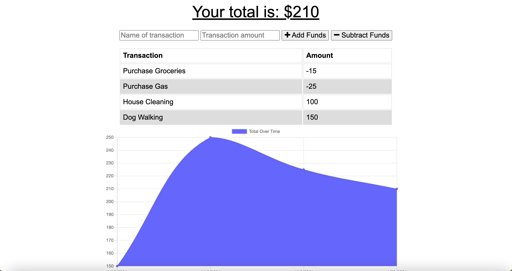

# budget-tracker 

  

    
    
    
    
    
    
    
  

## Assignment
  This application came with starter code with a full front and back end for Challenge 19 of the U of A Web Coding Bootcamp. The assigment was to update an existing budget tracker application to allow for offlicn access and functionality.
  
## Description
  This is a Progressive Web Application (PWA) that tracks withdrawals and deposits with or without a data/internet connection. 
  - When a user inputs an expense or depost, they receive a notification that they have added an expense or deposit. 
  - When a user loses their internet connection, expenses and deposits can be entered.
  -- When the internet connection is re-establisthed the deposits or expenses added while they were offline are added to their transaction history and their totals are updated. 

## Screenshots of web application 

## Table of Contents

* [Installation](#installation)
* [Usage](#usage)
* [License](#license)

* * *

## Installation
  :one: Clone the repository to your terminal. 
  :two: Intall Node.js to your terminal. 
  :three: Install npm packages contained in the package.json
  :four: Type `npm start` from the root of your project's directory in the terminal window

## Usage
   This project utilizes Node.js, Express.js for the server, MongoDB and Mongoose.js for the NoSQL database, and IndexDB and service workers to add offline functionality.
 
## License  
  
Licensed under the The MIT License (the "License");
you may not use this file except in compliance with the License.
You may obtain a copy of the License at

(https://opensource.org/licenses/MIT)

Unless required by applicable law or agreed to in writing, software
distributed under the License is distributed on an "AS IS" BASIS,
WITHOUT WARRANTIES OR CONDITIONS OF ANY KIND, either express or implied.
See the License for the specific language governing permissions and
limitations under the License.

    
